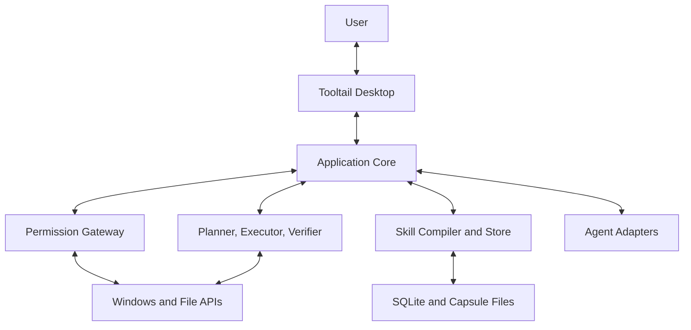

# System Architecture

## 1. Architectural goals

The v0.1 architecture must make the product hypotheses testable while preventing the prototype from becoming an unsafe general desktop agent.

Priorities, in order:

1. capability confinement;
2. deterministic and reversible effects;
3. inspectable learning;
4. testability without an interactive Windows desktop;
5. a responsive embodied UI;
6. provider and adapter replaceability;
7. later vertical expansion.

## 2. System context



All effects pass through the Permission Gateway. The WPF UI never calls file or Win32 mutation APIs directly. Compilers never execute actions. Agent adapters cannot grant themselves capabilities.

## 3. Recommended technology baseline

- Windows 11 x64 as the supported hypothesis-test platform.
- .NET 10 LTS and C#.
- WPF for the transparent desktop body and inspector windows.
- Microsoft.Extensions.Hosting for composition, background services, configuration, and lifetime.
- Microsoft.Data.Sqlite for local persistence.
- System.Text.Json for contracts; JSON Schema files are authoritative external artifacts.
- Windows UI Automation and Win32 APIs behind a narrow platform project.
- Windows named pipes for local process IPC if/when a component must be out of process.
- xUnit for unit, integration, contract, and property-oriented test suites.

Do not add a web runtime, Electron, a browser control, Entity Framework, a plugin runtime, or an agent SDK to v0.1 without a new ADR.

## 4. Solution structure

```text
Tooltail.sln
src/
  Tooltail.Domain/
  Tooltail.Application/
  Tooltail.Contracts/
  Tooltail.Infrastructure.LocalResearch/
  Tooltail.Infrastructure.Sqlite/
  Tooltail.Platform.Windows/
  Tooltail.Features.FileSkills/
  Tooltail.Adapters.AgentEvents/
  Tooltail.Desktop/
tests/
  Tooltail.Domain.Tests/
  Tooltail.Application.Tests/
  Tooltail.Contracts.Tests/
  Tooltail.Infrastructure.LocalResearch.Tests/
  Tooltail.ReleaseAudit.Tests/
  Tooltail.Infrastructure.Sqlite.Tests/
  Tooltail.Platform.Windows.Tests/
  Tooltail.Features.FileSkills.Tests/
  Tooltail.SkillFixtureCli.Tests/
  Tooltail.Adapters.AgentEvents.Tests/
  Tooltail.Architecture.Tests/
tools/
  Tooltail.AgentEventSimulator/
  Tooltail.SkillFixtureCli/
  Tooltail.ReleaseAudit/
docs/
```

### Dependency direction

```text
Domain <- Application <- feature/platform/infrastructure adapters <- Desktop
           ^
Contracts -+
```

- `Domain` has no framework, UI, database, OS, model, or adapter dependencies.
- `Application` coordinates use cases through interfaces.
- `Contracts` owns versioned serializable envelopes and DTOs, not domain behavior.
- `Infrastructure.Sqlite` implements repositories and migrations.
- `Infrastructure.LocalResearch` owns the separate consent-gated bounded JSONL sink, strict readback, preview/CreateNew export, and exact owned-data truncation.
- `Platform.Windows` owns all P/Invoke, HWND, DPI, native events, and WPF-window interop.
- `Features.FileSkills` owns snapshots, demonstration reconciliation, inference, planning, execution, verification, and undo for the constrained file vocabulary.
- `Adapters.AgentEvents` owns simulator, generic JSONL, and optional Codex JSONL mapping.
- `Desktop` is the WPF composition root and presentation layer.

Architecture tests must fail when `Domain` references WPF, Win32, SQLite, HTTP, model SDKs, or adapter assemblies.

## 5. Core domain concepts

### Companion

Stable identity and derived presentation state. It does not own raw model conversations.

### WindowLease

A short-lived association with a concrete window/process identity. It is context and presentation scope, not authority to mutate files or applications.

Identity includes at minimum:

- HWND;
- process ID;
- process start time or equivalent anti-reuse identity;
- top-level root HWND;
- application display name;
- issue and expiry timestamps;
- observed window title as display-only, never authority.

### ResourceGrant

A user-approved capability over an exact canonical resource root and action set. The initial type is `LocalFolderGrant`.

ADR 0011 implements existing-folder authority as picker intent, an in-memory five-minute exact-root/capability preview, and a separate confirmation that re-captures stable fixed-volume/non-reparse identity before issuing one seven-day grant. Selected canonical roots persist only as bounded Windows current-user DPAPI ciphertext in the existing protected-root field. Restart must decrypt and re-prove the exact identity; failure disables every file workflow while preserving an exact ID/root/ciphertext-bound revoke path. Safe-lab roots remain derivable from Tooltail-owned storage and grant ID.

### TeachingEpisode

A bounded before/after experience, normalized effects, user answers, and provenance. Raw watcher events are evidence, not the skill itself.

### Skill and SkillVersion

Stable skill identity with immutable version records. A version contains a validated SkillSpec, provenance, compatibility metadata, and lifecycle state.

### ExecutionPlan

An exact, ordered, immutable set of intended effects for specific input fingerprints under one skill version and grant.

### Approval

Consent bound to a plan fingerprint. Any material change invalidates it.

### ExecutionJournal and Receipt

Append-only record of planned, started, committed, verified, skipped, rolled-back, and failed steps. The receipt is the user-readable projection.

## 6. Application services

### CompanionStateProjector

Consumes committed, normalized domain events and derives the current body state. Event IDs are deduplicated within a bounded run history; reuse with conflicting normalized data, late sequence, time regression, impossible tool/input transitions, and attempts to reactivate a terminal run fail visibly. The deterministic precedence is failure, permission revoked, disconnected, needs input, blocked, paused, working, observing, completed-unopened, then idle/cancelled. Untrusted display labels never select state, identity, or authority. No LLM decides animation state.

### WindowBindingService

Coordinates drag-target discovery, eligibility checks, lease issue, tracking, expiration, and revocation through `IWindowSystem`.

### PermissionGateway

The only application service that can authorize an effect for execution. It validates the exact current grant/root/action set, canonical path containment, closed action type, canonical approval fingerprint, file identity, and skill lifecycle policy. `WindowLease` is intentionally absent because presentation/context scope is never mutation authority.

### TeachingSessionService

Starts a bounded session, snapshots the root, receives normalized watcher signals, stops, captures a final snapshot, reconciles evidence, and persists an episode.

### SkillCompiler

Produces a candidate SkillSpec from reconciled examples. v0.1 uses deterministic template inference. A later model compiler must implement the same interface and cannot bypass validation.

### SkillValidator

Validates schema, supported primitives, path semantics, variables, invariants, postconditions, and provenance. It returns field-localized errors and ambiguity.

### Planner

Instantiates a SkillSpec against current inputs, resolves variables, and emits an exact plan. It never mutates resources.

### RehearsalService

Produces a no-write dry-run and optionally executes against a Tooltail-owned temporary copy.

### SafeExecutor

Revalidates the plan immediately before each effect, writes the journal, executes an approved primitive, verifies it, and stops on mismatch.

### UndoService

Constructs and validates an inverse plan from committed journal steps. Undo is itself scope-checked, previewed, journaled, and verified.

### AgentRunService

Consumes normalized agent events and publishes content-minimized domain events. It launches only explicitly configured adapters and processes.

### CapsuleService

Exports/imports model-independent identity and skills. v0.1 may export before full import is enabled, but the schema and tests must exist from the beginning.

The Desktop exporter reconstructs complete immutable version histories from bounded SQLite projections, validates semantic lineage/content policy, canonicalizes every SkillSpec, and performs parser readback before any file write. It writes once with `CreateNew` under Tooltail-owned application storage. Physical roots, active grants, approvals, plans, journals, receipts, credentials, and raw contents are absent.

ADR 0009 enables native single-file import only for the unique pristine first-run companion. The feature layer captures bounded exact local bytes, hashes and previews them without mutation, and maps valid linear histories to Stale state. SQLite revalidates the complete pristine database and replaces the empty identity plus every version in one immediate transaction. Rebind is separate: a newly issued exact grant produces a parent-linked Draft whose semantic diff contains only `scope_binding`, after which the normal rehearsal and approval path applies. No imported lifecycle/evidence summary creates local trust or authority.

## 7. Desktop process model

Use a modular monolith for v0.1. One standard-user desktop process hosts WPF, application services, SQLite, and file operations.

Reasons:

- fewer IPC and lifecycle failure modes during hypothesis testing;
- easier transactional coordination;
- no false claim of security isolation from process separation alone;
- lower startup and packaging complexity.

The architecture still exposes interfaces at effect boundaries. A later hardened executor can move out of process without changing SkillSpec or application semantics.

If local IPC is introduced:

- use Windows named pipes, not a TCP listener;
- restrict the pipe ACL to the current user SID;
- use a random per-launch capability token in the first handshake;
- impose message size, idle, connect, and response timeouts;
- version the protocol;
- reject unknown methods and versions;
- never place secrets in discovery files.

## 8. Windows body and window tracking

### WPF surfaces

Use separate windows:

- `PetWindow`: transparent, topmost, not shown in taskbar, non-activating for ambient interactions;
- `TetherWindow`: click-through visual outline, no activation;
- `InspectorWindow`: standard accessible window that activates only on explicit open;
- optional `HomeWindow`: standard settings/workbench window.

The pet surface should handle `WM_MOUSEACTIVATE` so normal clicks do not steal focus from the target. Transparent pixels must not block underlying applications.

### DPI and coordinates

- Declare Per-Monitor V2 DPI awareness.
- Treat Win32 window rectangles as physical pixels.
- Treat WPF layout as device-independent pixels.
- Centralize conversion in `ICoordinateSpace`.
- Test negative monitor origins, scaling transitions, taskbar edges, rotation, maximize/minimize, and monitor removal.

### Underlying target discovery

During drag:

1. query the physical pointer position;
2. enumerate windows at/behind that point;
3. skip Tooltail-owned, invisible, cloaked, child-only, shell surface, secure, and tool windows;
4. normalize to an eligible top-level root owner;
5. resolve process identity and display metadata;
6. show a preview only after eligibility passes.

Do not use window title as an authority key. HWND values can be reused, so every subsequent check also verifies process identity.

### Tracking

Prefer out-of-context `SetWinEventHook` subscriptions for foreground, location, minimize, destroy, cloak, and relevant state changes. Keep native delegates rooted, marshal callbacks safely, guard reentrancy, and fall back to a low-frequency reconciliation timer. No high-frequency full desktop polling.

## 9. File observation architecture

`FileSystemWatcher` is a hint stream, not an authoritative transaction log. The teaching pipeline therefore uses:

1. baseline snapshot;
2. narrowly filtered watcher events;
3. final snapshot;
4. deterministic reconciliation between snapshots;
5. explicit failure if evidence cannot be reconciled.

Snapshots contain relative path, entry type, size, timestamps, selected attributes, reparse state, and a content hash when the configured size budget allows. Large-file hashing is bounded and cancellation-aware.

Watcher callbacks enqueue minimal signals and return immediately. Debounce and reconciliation occur elsewhere. Buffer overflow marks the episode incomplete and stops compilation.

Network paths, reparse points, alternate data streams, and inaccessible entries are rejected in v0.1.

## 10. Deterministic skill compiler

The compiler operates over source-to-destination example pairs and a small candidate language.

Candidate predicates:

- exact extension set;
- filename contains/prefix/suffix;
- simple anchored regular expression produced by the application, not arbitrary user code;
- origin relative directory.

Candidate transformations:

- preserve stem/extension;
- add or remove a constant prefix/suffix;
- case normalization;
- whitespace-to-separator slugification;
- insert selected date components from file metadata;
- move/copy to a constant relative directory;
- create missing constant directories.

Inference process:

1. enumerate candidates that explain every demonstrated pair;
2. reject candidates that require unsupported or unsafe behavior;
3. rank by coverage, minimal description length, and number of assumptions;
4. identify fields where multiple top candidates differ;
5. ask no more than two targeted questions;
6. require another example if material ambiguity remains.

An optional LLM compiler is deferred until the deterministic loop is proven. When added, observed names and content are untrusted data, output must conform to SkillSpec, and the same validator, rehearsal, and approval gates apply.

## 11. Execution architecture

### Plan creation

The planner produces an immutable operation list and fingerprints:

- skill version;
- grant;
- canonical root;
- input relative paths and file identities;
- relevant metadata/hashes;
- ordered effects;
- expected postconditions.

### Approval

Approval signs the plan fingerprint in local application state. It is not reusable if any fingerprint component changes.

Approval also carries a closed execution purpose. `production`, `rehearsal`, and `undo` approvals are not interchangeable. Rehearsal first copies a bounded, hash-verified fixture into a newly created Tooltail-owned temporary subroot, replans against that subroot while retaining the exact source SkillSpec hash, and then invokes the same executor and verifier with a rehearsal-only authorization. A Draft lifecycle is accepted only for this rehearsal purpose. Normal completion removes only the identity-checked workspace created by that rehearsal; ambiguous or unsafe cleanup remains visible instead of recursively deleting an unverified path. Undo requires its own canonical recovery-plan fingerprint and freshly consumed undo-only approval.

The Desktop durable composition persists the temporary grant, canonical rehearsal plan, and active rehearsal-only approval before the shared executor can open its journal. SQLite consumes that exact approval atomically with the journal-open event. After the run, the owned workspace is bounded and identity-checked before removal and the temporary grant is persisted as revoked; passing rehearsal requires the verified receipt, safe cleanup, and grant retirement together. Only then does Desktop capture a fresh authoritative source snapshot and persist a separate canonical production plan in `planned` state. That plan has no approval and cannot execute until a later explicit user decision.

For production, Desktop reloads the displayed plan from SQLite and compares its canonical bytes and fingerprint before accepting the deliberate user action. The exact Draft version first transitions to Approved, then one production-purpose approval is stored and consumed only with journal open. The executor reads the current persisted skill version and exact grant again before every effect and verification boundary. A verified receipt advances the same immutable version to Practiced; no success projection is emitted if receipt or lifecycle persistence disagrees. An authorization that fails before journal open is explicitly revoked rather than left reusable.

### Step execution

For each step:

1. re-resolve and canonicalize source/destination against the fixed root;
2. reject links, reparse points, network paths, alternate streams, or boundary escape;
3. verify grant and approval are active;
4. verify input fingerprint and collision policy;
5. append `StepIntentRecorded` with the plan fingerprint and closed inverse kind, then flush;
6. execute without a shell;
7. append `StepMutationObserved`, then `StepCommitted`, flushing each durable boundary;
8. verify postconditions against the exact plan;
9. append `StepVerified`, or append failure/recovery-required markers and stop.

The execution journal is an insert-only event stream. A step with intent but no commit is ambiguous and cannot be replayed automatically. Startup recovery projects each ordered prefix as not-started, started-uncommitted, committed-unverified, verified, recovery-required, or rolled-back, then inspects actual state before proposing any recovery action.

No overwrite is allowed. v0.1 SkillSpec has no delete primitive.

### Undo

Rename and same-root move actions have inverse actions. A copy, or an empty directory created by `ensure_directory`, can be undone only through the internal `remove_created_entry` recovery effect. That effect is deliberately absent from `FilePrimitive`, SkillSpec, schemas, and compiler output.

`UndoPlanner` accepts only a complete verified receipt and its exact standard journal. It validates the undo window, original plan fingerprint, skill/grant/root binding, current authoritative snapshot, and every destination identity/hash, then simulates inverse operations in reverse order. This permits Tooltail-created directories to become empty only after their exact child moves or copies have first been recovered, while unrelated pre-existing changes remain outside the inverse plan. A current collision, changed file, non-empty created directory, missing hash, prior rollback, reparse path, or expired receipt prevents a recovery plan from becoming ready.

The canonical recovery plan binds the original execution, original plan fingerprint and step sequence, closed recovery primitive, exact current entry evidence, current grant/root/capabilities, operation order, and lifetime. A fresh `undo` approval is consumed before the shared `FileSkillExecutor` recovery entry point opens a separate journal. Each inverse effect repeats authority and path/fingerprint checks, persists intent before mutation, uses no-overwrite relocation or non-recursive exact-created-entry removal, verifies an authoritative after-snapshot, and immediately links the original verified step to the distinct recovery execution. A successful recovery receipt requires both journals and every link to agree. Any mismatch or incomplete durable boundary leaves safe reason-coded residuals and never triggers automatic replay.

Desktop exposes this as two separate user actions. Preview reloads the standard receipt and exact journal, captures a current authoritative snapshot, derives the reverse-ordered recovery plan, stores its canonical document, and performs no mutation. Execute reloads that recovery document, original journal, receipt, current SkillVersion, and grant before issuing a new undo-purpose approval. The shared recovery executor consumes the approval with its distinct journal, verifies restoration, appends rollback links to the original journal, and stores a separate recovery receipt. The original production receipt remains retained.

Cross-volume moves are excluded. Any recovery material stored in local application data has a visible retention/expiry policy and is managed by application maintenance, not a learned skill.

### Headless acceptance composition

`Tooltail.SkillFixtureCli` is the M2 composition root for the complete loop. It accepts only an explicit, newly marked fixture workspace, uses fixed `root`, `artifacts`, `state`, and `temp` children, and emits bounded machine-readable results. The CLI composes the same compiler, canonical planner, permission gateway, SQLite repositories, executor/verifier, and recovery path used by the feature implementation. It adds no primitive and never invokes a shell.

For exact Linux/Windows fixtures only, a portable probe derives deterministic identities inside the marked workspace and a fixture fault boundary normalizes filesystem metadata immediately after a primitive. Neither is installed by the desktop/production composition; native Windows execution retains handle-derived volume and file identity. The fixture verifier persists an authoritative post-execution snapshot and requires a later snapshot, durable journal, and durable receipt all to agree. See [`FIXTURE_CLI.md`](FIXTURE_CLI.md).

## 12. Agent event architecture

The stable internal contract is Tooltail's normalized `AgentEvent`, not any provider's raw schema.

Required normalized event types are the closed enum in `agent-event.schema.json`:

- `run_started`, `run_completed`, `run_failed`, `run_cancelled`, `run_paused`, `run_resumed`, and `run_blocked`;
- `observation_started` and `observation_stopped`;
- `tool_started`, `tool_completed`, and `tool_failed`;
- `input_required` and `input_resolved`;
- `subagent_started` and `subagent_completed`;
- `permission_revoked`, `heartbeat`, and `adapter_disconnected`.

### Simulator

The simulator emits deterministic fixtures and timing variants. It is the acceptance-test source for body behavior.

### Generic JSONL adapter

Reads newline-delimited normalized events from stdin or a child process with bounded line size and strict schema validation.

### Codex adapter

v0.1 may launch `codex exec --json` for a user-approved prompt and workspace. The adapter:

- reads stdout JSONL only;
- never reads Codex session files;
- maps known event shapes conservatively;
- discards prompt, code, command output, paths, and reasoning content by default;
- ignores and counts unknown event types;
- treats malformed or oversized lines as adapter failure;
- pins behavior with recorded redacted fixtures;
- never builds on `codex app-server`, whose development interface may change without notice.

Agent runs and learned file skills are separate capabilities. An agent event cannot execute a file skill.

## 13. Persistence

SQLite is the source of truth for current application state. Use:

- foreign keys enabled;
- WAL mode when supported;
- explicit schema migrations;
- UTC timestamps;
- immutable skill versions and execution steps;
- transactions for application-level state changes;
- a single writer policy where practical;
- no secrets or raw model credentials in the database.

The database initializer treats the migration ledger and required schema as authority. It serializes writers, validates checksums and SQLite integrity in place, and exposes only read-only recovery access when history or structure is unknown; it never renames aside or replaces a failed user database with an empty one.

The file-skill state repository persists companions, exact local-folder grants, authoritative snapshots, monotonic teaching episodes and examples, immutable skill-version cores, canonical plans, and approval projections. Plan persistence recomputes the JSON digest and compares every executable field with the supplied domain definition; a hash that belongs to different semantics is rejected. Skill versions loaded from SQLite replay legal domain lifecycle transitions instead of trusting a stored enum.

Desktop correction retains the complete parent positive-example lineage and accepts an explicit closed clarification as new evidence. The deterministic correction compiler must produce version `n + 1`, a parent reference, an executable semantic diff, and a changed target-edge `SkillMatcher` result before persistence. The corrected version becomes the current immutable Draft with no approval, plan, or execution authority; its predecessor and all historical receipts remain unchanged, and the normal rehearsal/approval gates restart.

The integrated File Apprentice body uses `CompanionActivityProjector`, a pure Domain projection over closed accepted activity facts. It shares the interruptive precedence of normalized external runs: failure, permission revocation, disconnect, input, block, cancellation, working, observation, verified receipt, then scoped/home idle. Desktop marks a bounded use-case action active only after its eligibility gate and supplies a closed tool kind; it selects completion only from verified/persisted workflow results. On restart, recovery candidates, the latest execution, current skill lifecycle, latest lesson, and current grant state reconstruct the body from the bounded SQLite read model. The ambient Pet consumes this read-only projection, adding `scoped_idle` for a live WindowLease only when no stronger File Apprentice state exists. Neither projector, view model, nor vector control references an effect executor or permission gateway.

Desktop owns one linked cancellation source for the single active File Apprentice use case. Home and Inspector Cancel signal it directly; Safe Pause uses the same cooperative cancellation boundary and explicitly never resumes potentially mutable work. The control becomes interruptively visible before the workflow unwinds, while the workflow/executor remains responsible for durable cancellation or recovery markers. Folder-grant revocation separately reloads the exact current grant, persists its terminal revoked state, then signals active work to stop. It removes no file, invalidates all future planning/rehearsal/execution/Undo controls for that grant, and remains `permission_revoked` after restart. A new safe lab receives a new grant identity rather than reactivating the old grant.

The execution repository owns one serialized `BEGIN IMMEDIATE` writer boundary. Opening a journal atomically consumes the exact active approval, inserts the execution header, and appends the open event; one approval cannot authorize two executions. Later events are insert-only and are accepted only after the entire persisted prefix has been bounded, decoded, and replayed through `ExecutionJournal.Append`. Receipts are immutable versioned JSON and are revalidated against both the replayed journal and canonical plan before the execution receives its terminal projection.

Startup recovery is a read-only projection, not an automatic repair loop. Executions without receipts are bounded and classified as incomplete, receipt-missing, or requiring file-system inspection. No query replays a primitive or assumes that an intent, observed mutation, or commit completed safely.

Whole-product-memory deletion is a separate reviewed application-maintenance surface accepted by ADR 0008, not a SkillSpec primitive or Undo. Desktop requires an expiring two-step confirmation, refuses active work/teaching, durably revokes the current grant, and clears the independent research sink before the deletion service writes a bounded intent. The service derives only the fixed `state/tooltail.db`, WAL, SHM, and intent slots, validates local non-reparse ancestry, enumerates no targets, and removes the intent last. Startup processes a valid intent before opening SQLite; invalid or ambiguous state stops without replacement. Labs, user files, rehearsal residuals, Capsule exports, and separately copied research exports are outside that boundary.

See `DATA_AND_PROTOCOLS.md` for tables and `DATA_LIFECYCLE.md` for implemented locations, retention, export, deletion, and recovery.

## 14. Failure philosophy

Tooltail fails closed and exposes residual state.

- Unknown action: reject plan.
- Unknown schema version: refuse import/execute.
- Window identity mismatch: revoke lease.
- File identity mismatch after approval: stop before effect.
- Watcher overflow: invalidate lesson.
- Verification failure: stop and offer rollback where safe.
- Adapter schema drift: show Agent adapter unavailable; keep other product functions working.
- Database migration failure: open read-only recovery mode; do not create a fresh empty identity silently.

## 15. Observability

Use structured local logs with event IDs, severity, component, correlation IDs, and redaction.

Never log by default:

- prompt or response bodies;
- source code;
- file contents;
- raw keyboard input;
- full absolute user paths when a relative or redacted form works;
- environment variables or credentials;
- raw agent event payloads.

ADR 0010 implements a user-triggered closed diagnostic export with an exact JSON/SHA-256 preview. The Application builder accepts only typed body/tool enums, stable reason codes, UTC/product version, and bounded aggregate counts; it has no raw path/name/title/content/model/user/machine input field. Strict readback precedes a `CreateNew` write under the Tooltail-owned non-reparse `Diagnostics` root. There is no uploader or automatic collection.

M6 research events use the separate local-only sink accepted by ADR 0007. Collection is absent until visible opt-in and writes only the closed `research-event.schema.json` shape below Tooltail-owned application storage. Random study/session IDs and an unexported session salt replace user or machine identity; optional path equality uses only salted session-local tokens. Preview and deletion are explicit local actions, export uses `CreateNew`, and no uploader, analytics SDK, network client, authority object, or free-form event field exists.

## 16. Packaging

The first deliverable is a self-contained `win-x64` portable build. It runs as the standard user and does not request `uiAccess` or administrator elevation.

The accepted M7 artifact is an unsigned ZIP, not an installer. Production projects declare the sole distribution RID in `src/Directory.Build.props` so both generic and RID-specific NuGet graphs remain locked without changing portable target frameworks. The Desktop publish profile disables trimming, ReadyToRun, single-file bundling, and debug symbols for a reviewable WPF payload.

`Tooltail.ReleaseAudit` constructs a sorted fixed-timestamp archive only from a bounded, non-reparse publish tree and embeds a closed manifest with every payload length/hash, self-contained/runtime identity, unsigned status, separate `%LOCALAPPDATA%\Tooltail` data root, and `program_directory_only` removal scope. It rejects debug/state/export/archive material and strictly reads the ZIP back before writing its SHA-256 sidecar.

Portable-removal verification uses a newly created marker-bound fixture below repository artifacts. It launches only the packaged Tooltail apphost, rejects reparse entries, removes only the exact fixture `program` directory, and proves a sibling local-data sentinel remains unchanged. Failure retains both program and data fixtures for inspection. No product/runtime uninstall code, registry mutation, service, startup task, updater, shell invocation, or user-data deletion is added.

Code signing and a conventional installer are required before broad public distribution. Startup-at-login is off by default and deferred until the product loop is proven.

## 17. Architecture fitness functions

CI or architecture tests must enforce:

- Domain has no forbidden dependencies.
- Only Platform.Windows contains P/Invoke.
- Only approved executor classes call mutable `System.IO` APIs.
- SkillSpec primitives are an explicit closed set.
- every primitive has planner, executor, verifier, receipt, and undo tests;
- unknown JSON properties are tolerated only where the contract explicitly allows forward compatibility;
- unknown discriminators fail closed;
- no production source reads private Codex state directories;
- no production source calls a shell for learned skill execution;
- no screen-capture or global-keyboard dependency enters v0.1.
